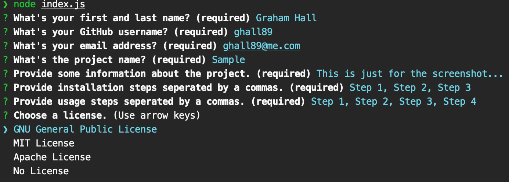

# Readme Generator

## Description

A node command line application that takes user input and generates a readme file for a GitHub Project. This readme was generated using this application.

## Table of Contents

- [Installation](#installation)
- [Usage](#usage)
- [License](#license)
- [Questions](#usage)

## Installation

- Install node if you don't already have it
- Clone this repo
- Navigate to the repo's location on your computer in your terminal
- Run the 'npm install' command and wait for the process to finish

## Usage

- From the repo directory in your terminal run 'node index.js
- Follow the on-screen prompts
- When the application is finished move README.md and LICENSE.md to the root of your own project
- Within your project create a folder called 'assets' and save a screenshot of your project in that folder as 'screenshot.png'

## License

Readme Generator
Copyright (C) 2021  Graham Hall

This program is free software: you can redistribute it and/or modify
it under the terms of the GNU General Public License as published by
the Free Software Foundation, either version 3 of the License, or
(at your option) any later version.

This program is distributed in the hope that it will be useful,
but WITHOUT ANY WARRANTY; without even the implied warranty of
MERCHANTABILITY or FITNESS FOR A PARTICULAR PURPOSE.  See the
GNU General Public License for more details.

You should have received a copy of the GNU General Public License
along with this program.  If not, see <https://www.gnu.org/licenses/>.
      
  
## Questions

Direct any questions to [Graham Hall](http://github.com/ghall89) via email at ghall89@me.com

